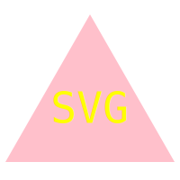

# SVG Logo Maker

## Table of Contents

- [**Description**](#📑-description)
- [**Installation**](#💾-installation)
- [**Usage**](#💻-usage)
- [**Technology**](#🦾-technology)
- [**Test**](#🧪-test)
- [**Questions**](#❓-questions)

## 📑 Description

SVG Generator enables the user to create a cool svg logo. This command-line application prompts the user with 4 questions to create a unique logo. The user can have up to three letters in their logo with the text color of their choosing. The logo can be one of three shapes: circle, triangle or a square with a fill color that the user selects.

[Walkthrough Video Here](https://youtu.be/aZxuyF5UvqI)

## 💾 Installation

From the GitHub Repository, clone down the svg-generator to your machine. Once installed, and in the folder, run `npm i` install necessary files, including inquirer@8.2.4. It is highly recommended that the user download an SVG Preview extension to view output in correct format. 

## 💻 Usage

Web developers dream, creating a personalized logo with command-line application and no CSS. Run `node index.js` to initialize the application and create as many unique logos as you would like. Files are saved as `.svg` 

## 🦾 Technology

**Inquirer 8.2.4**

## 🧪 Test

Testing with Jest completed. Testing completed for each shape to ensure output was correct. 

## ❓ Questions

🖐 My name is Cassie! If you have any question about me or the project, feel free to contact me:

- Github: [CTep09](https://github.com/CTep09)

- Email: [CassandraY9@gmail.com](mailto:cassandray9@gmail.com)
